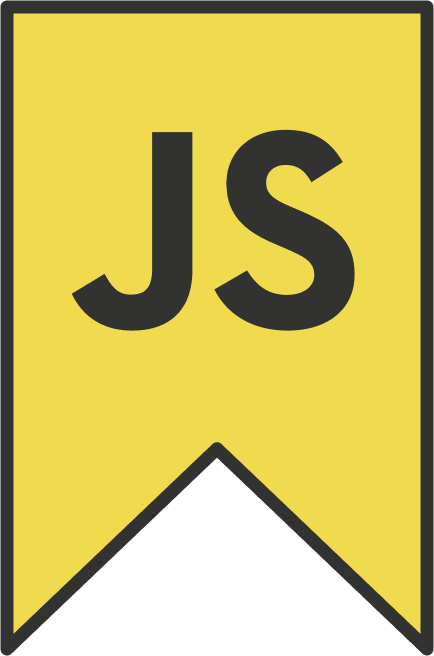

# JS To Bookmarklet

<p align="center">

</p>  

<hr/>

- [JS To Bookmarklet](#js-to-bookmarklet)
  - [What are Bookmarklets](#what-are-bookmarklets)
  - [What is this tool?](#what-is-this-tool)
  - [What does this PowerShell script do?](#what-does-this-powershell-script-do)
  - [How do I run this script?](#how-do-i-run-this-script)
  - [How do I create a Bookmarklet?](#how-do-i-create-a-bookmarklet)
    - [Google Chrome](#google-chrome)
    - [Brave](#brave)
    - [Microsoft Edge](#microsoft-edge)
    - [Firefox](#firefox)

## What are Bookmarklets

Bookmarklets are small JavaScript snippets that you can save into your Bookmarks bar. You can run the JavaScript code by just clicking the bookmark like any other usual link on your bookmarks bar.

## What is this tool?

JS-to-bookmarklet is a PowerShell script I created to convert Javascript files into the Bookmarklet syntax.

## What does this PowerShell script do?

It's a pretty small utility, in fact it's a lesser amount of lines than this README. All it does is takes out all the line breaks and spaces from a JavaScript file and inserts the Bookmarklet browser syntax around it. Feel free to edit it as you need if something does not work in your JavaScript bookmarklet.

## How do I run this script?

1. Download the files from this repository through the "Clone" button, or using the git command line
2. Navigate to the downloaded folder in File Explorer
3. Add your JavaScript file to the root of the folder, next to the .ps1 file
4. Open the PowerShell file in a text editor, and change the $fileName to your script's name
5. Navigate back to the downloaded folder in File Explorer
6. Right click the ```JS-to-bookmarklet.ps1``` PowerShell file and select "_Run with PowerShell_"

## How do I create a Bookmarklet?

### Google Chrome

> 1. Navigate to the URL [chrome://bookmarks/](https://chrome://bookmarks/)
> 2. On the top right of Bookmarks page's navbar, click the hamburger icon
> 3. Select "Add new bookmark"
> 4. Enter the following information:
>    1. Name: What you would like your bookmark title text to say
>    2. URL: Insert your Bookmarklet JavaScript code, which was outputted to the file {YourFile.js}.bookmarklet.txt
> 5. Click "Save"

### Brave

> 1. Navigate to the URL [brave://bookmarks/](brave://bookmarks/)
> 2. On the top right of Bookmarks page under the navbar, click the hamburger icon
> 3. Select "Add new bookmark"
> 4. Enter the following information:
>    1. Name: What you would like your bookmark title text to say
>    2. URL: Insert your Bookmarklet JavaScript code, which was outputted to the file {YourFile.js}.bookmarklet.txt
> 5. Click "Save"

### Microsoft Edge

> 1. Navigate to the URL [edge://favorites/](https://edge://favorites/)
> 2. On the upper right of the Favorites page, click "_Add favorite_"
> 3. Enter the following information:
>    1. Name: What you would like your bookmark title text to say
>    2. URL: Insert your Bookmarklet JavaScript code, which was outputted to the file {YourFile.js}.bookmarklet.txt
> 4. Click "Save"

### Firefox

> 1. Press "_Ctrl + Shift + O_" to open the Library
> 2. Click "Organize", then "New Bookmark"
> 3. Enter the following information:
>    1. Name: What you would like your bookmark title text to say
>    2. Location: Insert your Bookmarklet JavaScript code, which was outputted to the file {YourFile.js}.bookmarklet.txt
> 4. Click "Add"
